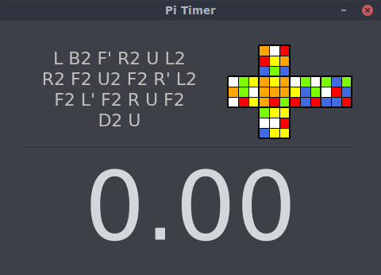

## Pi Timer

A really really basic rubik's cube timer.

### Why

The main purpose of this rubik's timer against the others is to be used with low resolution, in particular is designed to be used with raspberry on 3.5' LCD (480x320), but works with any resolution obviously.

### Functionalities

1. Scramble generator 
2. Scramble preview
3. Timer

(coming soon: stats)

### What it looks like



### Usage

```
git clone https://github.com/Docheinstein/pi-timer.git
cd pi-timer
python3 main.py
```

### Settings

Pi Timer is highly customizable.  
Modify the `config.json` as needed.  
The default `config.json` content is the following:
``` 
{
  "width": 480,
  "height": 320,

  "display_fontsize": 120,
  "scramble_fontsize": 22,

  "background_color": "#3d4147",
  "scramble_color": "#c2c1be",
  "display_color": "#d3d6db",
  "ready_color": "#18e615",
  "plus_two_color": "#db9448",
  "dnf_color": "#cc2f16",

  "timer_buttons": [32, 83],
  "cancel_buttons": [16777219, 16777216],

  "scramble_length": 20,
  "inspection_seconds": 15,

  "scramble_preview": true,
  "scramble_preview_size": 180,
  "scramble_up_color": "yellow",
  "scramble_down_color": "white",
  "scramble_front_color": "orange",
  "scramble_back_color": "red",
  "scramble_right_color": "royalblue",
  "scramble_left_color": "lawngreen "
}
```